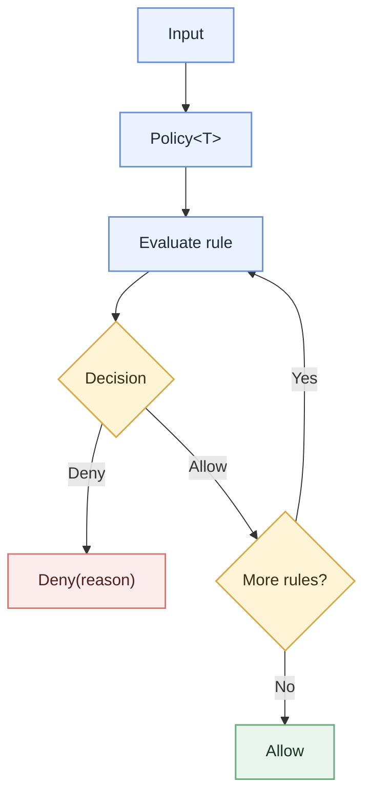

# Kotlin Policy

[](https://github.com/bksampadi/kotlin-policy/actions/workflows/ci.yml)

A small, type-safe policy evaluation library built with Kotlin. Rules are evaluated in order, and the first denial stops evaluation.

## Architecture



## Design

- **`Decision`** — `Allow` or `Deny(reason)` using a sealed interface.
- **`Rule<T>`** — a type-safe functional interface for individual checks.
- **`Policy<T>`** — evaluates rules in order and stops at the first denial.
- **No framework required** — simple, reusable domain logic.

## Status

**Working learning library.** Ordered, type-safe rule evaluation with explicit allow/deny decisions and fail-fast behavior. Unit tests cover all-pass, first-denial, and short-circuit execution; GitHub Actions runs formatting checks and tests. No HTTP API or persistence layer.

## Build & test

Requires **JDK 21**. On Windows:

```powershell
.\gradlew.bat spotlessCheck test
```

A focused Kotlin learning project exploring sealed types, generics, lambdas, and fail-fast evaluation.
